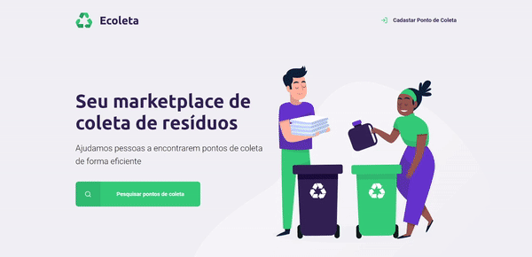

# Ecoleta :recycle:

> #### :globe_with_meridians: Helping people find recycling points in an easy way.

  

---

> This project was build during **Next Level Week** promoted by [Rocketseat](https://github.com/rocketseat).\
> This is the NLW Starter version.

# :pushpin: Table of Contents

- [Features](#bulb-features)
- [Requirements](#construction-requirements)
- [Installation](#white_check_mark-installation)
- [Quick Start](#rocket-quick-start)
- [Technologies](#fire-technologies)
- [Contributing](#robot-contributing)
- [License](#pencil-license)

# :bulb: Features

- [x] :recycle: Explore recycling points near you.
- [x] :earth_americas: Create new recycling points.
- [x] :mag_right: Filter recycling points by city.

# :construction: Requirements

- [x] Git
- [x] Node.js

# :white_check_mark: Installation

**First check if you have all the requirements above, then clone this repository:**

- Using HTTP protocol:

  - `git clone https://github.com/Yuziem14/ecoleta.git`

- Using SSH protocol:

  - `git clone git@github.com:Yuziem14/ecoleta.git`

- Switch to this branch, running: `git checkout ecoleta-starter`

_Obs: Only clone with SSH if you already have a safe SSH key configured._

# :rocket: Quick Start

**Be sure to run the following steps inside this folder.**

1.  In order to install dependencies, run: `npm install`

2.  In order to setup the database, run: `npm run db:create`

3.  In order to seed the database, run: `npm run db:seed`

4.  Finally, run your server using: `npm run start`

_Obs: If you want, use yarn instead of npm._

# :fire: Technologies

This project was build with:

- [Node.js](https://nodejs.org/en/) + [Express.js](http://expressjs.com/)
- [Nunjucks](https://mozilla.github.io/nunjucks/)
- [SQLite](https://sqlite.org/index.html)

# :robot: Contributing

Read the [Contribute Guidelines](CONTRIBUTING.md).

# :pencil: License

Read the [License](LICENSE.md) for this project.

---

> _Made with :green_heart: by Yuri Ziemba._
